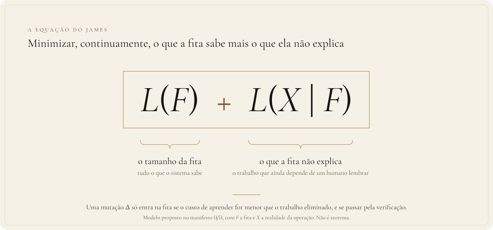
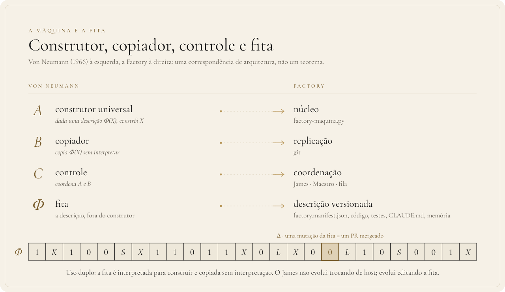

<div align="center">

**Português** · [English](MANIFESTO.en.md) · [Français](MANIFESTO.fr.md)

</div>

# Manifesto matemático do James

> **Fase 0 · versão técnica.** Este documento formaliza a filosofia do James com as
> ferramentas da física da informação, da teoria da computabilidade e da teoria
> algorítmica da informação. Toda afirmação está classificada na [§8](#8-tabela-de-honestidade)
> como **teorema** (resultado da literatura), **correspondência** (mapeamento de
> arquitetura), **modelo** (formalização proposta aqui) ou **hipótese** (a medir).

> [!NOTE]
> **O que este repositório prova.** Três enunciados da §9, sobre **modelos** escritos em Lean 4,
> verificados pelo kernel, sem `sorry` e só com os axiomas padrão. Não é uma prova sobre o código de
> produção. O que cada teorema enuncia de fato está em [O que está provado aqui](#o-que-está-provado-aqui).

---

## 0. Resumo

A pergunta que orienta o sistema é:

> **Qual é o mínimo de dados da realidade necessário para representar a própria realidade?**

Ela tem nome: é a **complexidade de Kolmogorov**. Três fatos sobre ela organizam tudo:

1. **Ela existe, mas é incomputável.** Nenhum procedimento garante ter achado a descrição
   mínima; cada programa escrito é só um limite superior. O trabalho de comprimir a
   realidade é, por construção, um laço sem fim.
2. **Ela não depende da máquina**, a menos de uma constante (teorema da invariância). A
   identidade de uma descrição não está no hardware que a executa.
3. **Comprimir custa energia, e conhecimento prévio barateia o custo** (Landauer, Bennett,
   Wolf). Reduzir entropia local é possível; o preço é informação.

O James é a engenharia desses três fatos: uma **máquina universal** (von Neumann) que
lê uma **fita** versionada e trabalha para minimizar, continuamente,

```math
\boxed{\;L(F) \;+\; L(X \mid F)\;}
```

onde $F$ é a fita (tudo que o sistema sabe) e $X$ é a realidade da operação. O segundo
termo é, literalmente, **o trabalho que ainda depende de um humano lembrar**.

<p align="center">
  
</p>

---

## 1. A pergunta

No conto *A Última Pergunta* (Asimov, 1956), a humanidade pergunta a um computador, por
bilhões de anos, se a entropia pode ser revertida. A resposta é sempre que os dados são
insuficientes. No fim, a resposta é um ato: *haja luz*.

Este sistema não trata da entropia do universo. Trata da **entropia local** de uma
operação: incerteza, ambiguidade, exceção, regra que mora na cabeça de alguém.

```math
\text{caos} \to \text{estrutura}, \quad
\text{implícito} \to \text{explícito}, \quad
\text{exceção} \to \text{regra}, \quad
\text{experiência} \to \text{memória}.
```

A tese é que cada uma dessas setas é uma **compressão**, e que compressão tem teoria,
custo físico e limite.

---

## 2. A física: reverter entropia custa informação

### 2.1 O demônio de Maxwell

Maxwell (1871) imaginou um agente que separa moléculas rápidas de lentas, reduzindo a
entropia de um gás sem gastar trabalho, o que violaria a segunda lei. A resolução levou
um século (Szilard 1929, Landauer 1961, Bennett 1982): o demônio **mede e memoriza**, e
para operar em ciclo precisa **apagar a memória**.

### 2.2 Princípio de Landauer

Apagar um bit de informação num ambiente à temperatura $T$ dissipa no mínimo

```math
W_{\text{apagar}} \;\ge\; k_B\, T \ln 2 \quad \text{por bit.}
```

O ganho do demônio é pago pelo apagamento. Reduzir entropia local é possível; o preço é
pago em informação processada e descartada.

### 2.3 A reformulação de Wolf

Wolf mostrou que o custo de apagar uma sequência $x$ não é proporcional ao seu tamanho
$`|x|`$, mas ao tamanho da sua **melhor compressão**; e que, se o demônio já possui
conhecimento prévio $y$ sobre $x$, o que conta é o poder **algorítmico** desse
conhecimento. Informalmente:

```math
W_{\text{apagar}}(x \mid y) \;\approx\; k_B T \ln 2 \cdot K(x \mid y).
```

**Leitura para o James:** conhecimento acumulado ($y$) reduz o custo físico de lidar com
a realidade ($x$). A frase *computação → conhecimento → menos computação* tem um
análogo termodinâmico.

---

## 3. A máquina universal

### 3.1 Turing

Existe uma máquina $U$ que, dada a descrição $`\langle M \rangle`$ de qualquer máquina $M$
e uma entrada $w$, simula $M$ em $w$:

```math
U(\langle M \rangle, w) = M(w).
```

O comportamento sai do hardware e vira dado.

### 3.2 Von Neumann: construtor, copiador, controle e fita

Von Neumann (1966, póstumo) perguntou o que é necessário para uma máquina construir
outra, inclusive a si mesma, **sem perder a capacidade de ficar mais complexa**. Sua
resposta tem quatro partes:

| Componente | Função |
|---|---|
| $A$ · construtor universal | dada uma descrição $`\Phi(X)`$, constrói $X$ |
| $B$ · copiador | copia $`\Phi(X)`$ **sem interpretar** |
| $C$ · controle | coordena $A$ e $B$ |
| $`\Phi`$ · fita | a descrição, **fora** do construtor |

Alimentando o sistema com a própria descrição, $`\Phi(A+B+C)`$, ele se reproduz. Três
observações fazem o resultado importar:

1. **A fita tem uso duplo:** é *interpretada* para construir e *copiada sem
   interpretação* para o descendente. Von Neumann separou transcrição de construção antes
   da descoberta da estrutura do DNA.
2. **Uma descrição não pode conter uma cópia de si do mesmo tamanho**, assim como um
   recipiente não contém outro igual. Por isso o copiador existe separado.
3. **A evolução acontece na fita, não na máquina.** Mutações em $`\Phi`$ produzem máquinas
   diferentes, e é isso que permite crescimento de complexidade sem limite.

### 3.3 Correspondência com a Factory

| Von Neumann | Factory | Artefato |
|---|---|---|
| $A$ · construtor | núcleo | `factory-maquina.py` |
| $B$ · copiador | replicação | `git` |
| $C$ · controle | coordenação | James / Maestro / fila |
| $`\Phi`$ · fita | descrição versionada | `factory.manifest.json`, código, testes, `CLAUDE.md`, memória |
| espaço celular | substrato | qualquer host com processo, disco, rede, segredo e agendador |
| $D$ · autômato arbitrário | produto | MyBagCenter, sites, integrações |

**Consequência:** o James não evolui trocando de host. **Ele evolui editando a fita.**
Cada PR mergeado é uma mutação de $`\Phi`$.

<p align="center">
  
</p>

---

## 4. O mínimo: complexidade de Kolmogorov

### 4.1 Definição

Fixada uma máquina universal $U$, a complexidade de um objeto finito $x$ é o comprimento
do menor programa que o produz:

```math
K_U(x) = \min \{\, |p| \;:\; U(p) = x \,\}.
```

Com informação lateral $y$ disponível de graça:

```math
K_U(x \mid y) = \min \{\, |p| \;:\; U(p, y) = x \,\}.
```

**Esta é a resposta formal à pergunta da §0.** O mínimo de dados para representar $x$ é
$K(x)$; dado o que já se sabe ($y$), é $`K(x \mid y)`$.

### 4.2 Invariância: host não é identidade

Para quaisquer duas máquinas universais $U$ e $V$ existe uma constante $`c_{UV}`$,
independente de $x$, tal que

```math
\left|\, K_U(x) - K_V(x) \,\right| \;\le\; c_{UV}.
```

**Leitura para o James:** Claude, Codex, Qwen e Nemotron são máquinas universais
diferentes. A descrição mínima da operação é a mesma em todas, a menos de uma constante
que não cresce com a operação. **A identidade é a descrição; o motor é a constante.**

### 4.3 Incomputabilidade: o laço sem fim

$K$ não é computável. Todo programa $p$ com $U(p) = x$ prova que $`K(x) \le |p|`$, mas
nenhum procedimento geral prova que não existe um $p'$ menor.

**Leitura para o James:** o sistema só consegue abaixar **limites superiores**. Não
existe um estado em que ele sabe que terminou de comprimir. É o "dados insuficientes"
do conto, como teorema, e é por isso que o James é um laço e não um projeto.

### 4.4 Comprimir é entender

Solomonoff (1964) mostrou que ponderar hipóteses por $`2^{-K(h)}`$ dá uma teoria de
indução ótima em sentido preciso: a descrição mais curta que explica os dados é a
melhor previsão. Comprimir não é só economizar bytes; é modelar a estrutura.

### 4.5 Relação com Shannon

Para fontes aleatórias, a complexidade esperada por símbolo converge para a entropia de
Shannon $H$. Entropia é compressibilidade média; Kolmogorov é compressibilidade de **um**
objeto. A operação da empresa é um objeto só, então a medida certa é a segunda.

---

## 5. A equação do James

### 5.1 Comprimento mínimo de descrição (MDL) em duas partes

Como $K$ é incomputável, a prática usa o princípio MDL (Rissanen, 1978): a melhor
explicação de dados $X$ é o modelo $F$ que minimiza

```math
L(F) + L(X \mid F),
```

o tamanho do modelo mais o tamanho dos dados codificados com o modelo.

### 5.2 O mapeamento **[modelo]**

- $`X_{1:n}`$: a história da operação até o instante $n$ (pedidos, eventos, pedidos de
  clientes, incidentes).
- $`F_n`$: a fita no instante $n$ (código, testes, manifesto, regras, memória).
- $`L(F_n)`$: o tamanho do que o sistema sabe.
- $`L(X_{n+1} \mid F_n)`$: o que a fita **não** explica no próximo período. É a exceção, o
  julgamento de novo, o passo manual, **o trabalho que depende de alguém lembrar.**

O objetivo do James é

```math
F^\star = \arg\min_F \; L(F) + \mathbb{E}\big[\, L(X \mid F) \,\big].
```

### 5.3 A regra de atualização

Uma mutação $\Delta$ da fita ($`F_{n+1} = F_n \oplus \Delta`$) é aceita se, e só se:

```math
\underbrace{L(F_n \oplus \Delta) - L(F_n)}_{\text{custo de aprender}}
\;<\;
\underbrace{\mathbb{E}\,L(X \mid F_n) - \mathbb{E}\,L(X \mid F_n \oplus \Delta)}_{\text{trabalho eliminado}}
```

**e** $\Delta$ passa pela verificação (teste, CI, aprovação humana onde o risco exige).

A primeira condição diz quando aprender. A segunda diz que só entra na fita o que foi
verificado. **O que não foi mergeado não mudou $F$:** descoberta sem entrega é entropia
adiada.

### 5.4 As regras da casa como consequências

**R1 · "Fez à mão duas vezes? A segunda era para ter sido código."**
Seja um procedimento que custa $\ell$ bits para ser descrito por um humano, e que
aparece $k$ vezes. Sem regra, custa $k\ell$. Como regra, custa $\ell + r$ uma vez
($r$ = sobrecarga de nome, teste e integração) mais $c$ por ocorrência ($c$ = o custo de
invocar a regra). A regra compensa quando

```math
k\ell \;>\; \ell + r + kc
\quad\Longleftrightarrow\quad
k \;>\; \frac{\ell + r}{\ell - c}.
```

Quando $`r, c \ll \ell`$, o limiar tende a $`1^{+}`$: **a partir da segunda ocorrência,
vale a pena.** A regra empírica da casa é o limiar da desigualdade.

**R2 · "Pediram pão? Faça a padaria."**
Uma regra que cobre a **classe** de pedidos tem $k$ igual ao número esperado de
instâncias futuras da classe, não 1. Generalizar é maximizar o lado direito de §5.3.

**R3 · "O resort sem hóspede."**
Se o número esperado de instâncias é pequeno, $`L(F \oplus \Delta) - L(F)`$ supera o
trabalho eliminado e a mutação deve ser **rejeitada**. É sobreajuste: a fita cresceu
mais do que a realidade que ela explica. O MDL penaliza isso sozinho.

**R4 · "Não se remenda pano velho com tecido novo."**
Empilhar exceções aumenta $`L(X \mid F)`$ sem reduzir $L(F)$. Reescrever a forma pode
diminuir as duas parcelas ao mesmo tempo, e aí qualquer remendo é dominado.

### 5.5 Descobrir é caro, verificar é barato

Achar $\Delta$ é busca: cara, cheia de tentativa, feita por agentes. Verificar $\Delta$ é
checagem: barata, feita por teste, CI e aprovação. É a assimetria de NP (achar a
testemunha é difícil; conferir é fácil) usada como **norte de engenharia, não como
teorema sobre P e NP**. O modelo de custo da Fase 1 torna isso preciso:

```math
C_{\text{total}}(N) \;\le\; D \cdot S_{\max} \;+\; N \cdot V_{\max},
```

onde $N$ é o número de tarefas, $D$ o número de tarefas **distintas**, $S$ o custo de
busca e $V$ o de verificação. Se $D$ cresce mais devagar que $N$, o custo por tarefa
tende ao custo de verificar: **$`O(n) \to O(1)`$ amortizado.**

---

## 6. A alma: identidade é o log

O estado do James é a dobra de uma função pura de transição sobre o log de eventos:

```math
S_n = \operatorname{foldl}(\delta,\, S_0,\, [e_1, \dots, e_n]).
```

Se $\delta$ é determinística, dois corpos quaisquer que reproduzem o mesmo log chegam ao
mesmo estado. A identidade mora no log e na fita, não no host. Junto com a invariância
(§4.2), isso é a forma matemática da lei do sistema: **`rm -rf <qualquer-host>` não pode
destruir o James.**

---

## 7. Fechamento

Juntando as peças:

1. A realidade da operação tem uma descrição mínima, $K(X)$. **(Kolmogorov)**
2. Ela não depende do motor, a menos de uma constante. **(invariância)**
3. Ela nunca é alcançada com certeza, só aproximada por cima. **(incomputabilidade)**
4. Aproximá-la custa energia, e o custo cai com o que já se sabe. **(Landauer, Wolf)**
5. Uma máquina que guarda a descrição fora de si e evolui editando-a pode crescer em
   complexidade sem limite. **(von Neumann)**
6. O James é essa máquina, minimizando $`L(F) + L(X \mid F)`$. **(modelo)**

A pergunta *a entropia pode ser revertida?* recebe, localmente, uma resposta de
engenharia: **sim, um bit de cada vez, pagando em computação e guardando o que foi
aprendido para que o próximo bit custe menos.** E ela nunca termina, porque o mínimo é
incomputável.

---

## 8. Tabela de honestidade

| Afirmação | Status |
|---|---|
| Custo mínimo de apagamento $`k_B T \ln 2`$ por bit | **teorema** (Landauer; formulação precisa com hipóteses, ver Norton) |
| Custo de apagamento proporcional à compressão, dado conhecimento prévio | **teorema** (Wolf), usado aqui de forma informal |
| Construtor universal com fita de uso duplo | **teorema** (von Neumann; implementado em autômato celular) |
| $K$ incomputável; invariância até constante | **teoremas** (Kolmogorov, Chaitin, Solomonoff) |
| Factory ↔ construtor/copiador/controle/fita | **correspondência** de arquitetura |
| O James minimiza $`L(F) + L(X \mid F)`$ | **modelo** proposto neste documento |
| R1–R4 derivadas da regra de atualização | **modelo** (derivação dentro do modelo) |
| Custo operacional cai à medida que $F$ comprime $X$ | **hipótese**, a medir na Fase 2 |
| Wolf ↔ custo operacional real da empresa | **analogia**, não identidade física |

**Fronteira explícita:** nada aqui prova que a empresa funciona. Os teoremas valem para
os modelos; a Fase 2 existe para medir se o sistema se comporta como o modelo.

---

## 9. Rumo à Fase 1 (Lean 4)

Três afirmações são pequenas o bastante para serem provadas sobre modelos formais:

| Pilar | Enunciado (informal) | Declaração Lean neste repositório |
|---|---|---|
| **Conhecimento** · amortização | Para qualquer sequência de $N$ tarefas com $D$ distintas, com base de conhecimento monotônica, $`C_{\text{total}} \le D\,S_{\max} + N\,V_{\max}`$. | [`James.Conhecimento.amortizacao`](JamesTheorems/Conhecimento.lean#L119) |
| **Segurança** · gate | Em todo estado alcançável, nenhuma ação crítica foi executada sem aprovação registrada no log. | [`James.Seguranca.gate`](JamesTheorems/Seguranca.lean#L74) |
| **Alma** · replay | Se $\delta$ é pura, dois hosts que aplicam o mesmo log a partir de $`S_0`$ chegam ao mesmo estado. | [`James.Alma.replay`](JamesTheorems/Alma.lean#L32) (e [`retomada`](JamesTheorems/Alma.lean#L38), [`revezamento`](JamesTheorems/Alma.lean#L44)) |

O próprio Lean encarna a §5.5: **encontrar a prova é busca cara; o kernel a verifica
barato.** Formalizar o James em Lean é o sistema se descrevendo na linguagem que ele
mesmo pratica.

### O que está provado aqui

Os enunciados acima são informais; o que o kernel do Lean verificou é isto, nos modelos
definidos neste repositório (não no código de produção):

- **Conhecimento.** [`amortizacao`](JamesTheorems/Conhecimento.lean#L119): para toda lista de
  tarefas `ts`, processada a partir de uma base vazia por
  [`processar`](JamesTheorems/Conhecimento.lean#L27) (busca na primeira vez, só verificação
  quando a tarefa já está na base), a base final não tem repetições, contém exatamente as
  tarefas de `ts`, o número de buscas é o tamanho dessa base ($D$), e
  `custo = D · busca + N · verificação`, com **igualdade**. O modelo usa um custo fixo de busca
  e um de verificação ([`Custos`](JamesTheorems/Conhecimento.lean#L16)); a forma com
  $`S_{\max}`$ e $`V_{\max}`$ para custos variáveis é a leitura informal, não o enunciado Lean.
  Corolário: [`buscas_le`](JamesTheorems/Conhecimento.lean#L134).
- **Segurança.** [`gate`](JamesTheorems/Seguranca.lean#L74): para **todo** log de eventos
  (inclusive escrito por um adversário), no estado `log.foldl passo inicial` toda ação crítica
  executada tem o seu identificador entre as aprovadas. A garantia vem do próprio
  [`passo`](JamesTheorems/Seguranca.lean#L31), que ignora a execução crítica não aprovada; o
  invariante é [`passo_preserva`](JamesTheorems/Seguranca.lean#L43).
- **Alma.** [`replay`](JamesTheorems/Alma.lean#L32): dois corpos com a mesma função de passo
  chegam ao mesmo estado a partir do mesmo log, quaisquer que sejam nome e motor.
  [`retomada`](JamesTheorems/Alma.lean#L38): morrer depois do evento `k` e continuar do
  snapshot dá o mesmo estado. [`revezamento`](JamesTheorems/Alma.lean#L44): qualquer divisão
  do log entre corpos dá o mesmo estado. Em Lean toda função é pura, então "δ pura" é a forma do
  modelo, não uma hipótese a mais.

Sem Mathlib, sem `sorry`, sem `native_decide`. [`Axiomas.lean`](Axiomas.lean) imprime os
axiomas de que cada teorema depende: só `propext` e `Quot.sound`. São **modelos, não código
de produção**: se o sistema real se comporta como o modelo, as propriedades valem; medir se
ele se comporta é a Fase 2.

---

## Referências

- Maxwell, J. C. (1871). *Theory of Heat*.
- Szilard, L. (1929). Über die Entropieverminderung in einem thermodynamischen System
  bei Eingriffen intelligenter Wesen. *Z. Phys.* 53.
- Turing, A. M. (1936). On Computable Numbers, with an Application to the
  Entscheidungsproblem.
- Asimov, I. (1956). *The Last Question*.
- Landauer, R. (1961). Irreversibility and Heat Generation in the Computing Process.
  *IBM J. Res. Dev.* 5.
- Solomonoff, R. (1964). A Formal Theory of Inductive Inference.
- Kolmogorov, A. N. (1965). Three Approaches to the Quantitative Definition of
  Information.
- Chaitin, G. (1966, 1969). On the Length of Programs for Computing Finite Binary
  Sequences.
- von Neumann, J.; Burks, A. W. (ed.) (1966). *Theory of Self-Reproducing Automata*.
- Rissanen, J. (1978). Modeling by Shortest Data Description. *Automatica* 14.
- Bennett, C. H. (1982). The Thermodynamics of Computation — a Review. *Int. J. Theor.
  Phys.* 21.
- Li, M.; Vitányi, P. *An Introduction to Kolmogorov Complexity and Its Applications*.
- Vitányi, P.; Li, M. (2000). Minimum Description Length Induction, Bayesianism, and
  Kolmogorov Complexity. *IEEE Trans. Inf. Theory* 46.
- Grünwald, P. (2004). A Tutorial Introduction to the Minimum Description Length
  Principle.
- Norton, J. D. Eaters of the Lotus: Landauer's Principle and the Return of Maxwell's
  Demon.
- Wolf, S. (2017). Landauer's Erasure Principle and Data Compression. *ISIT*.
