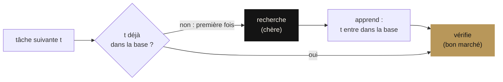

<div align="center">

[English](README.md) · [Português](README.pt-BR.md) · **Français**

<picture>
  <source media="(prefers-color-scheme: dark)" srcset="docs/assets/banner-escuro.png">
  <source media="(prefers-color-scheme: light)" srcset="docs/assets/banner-claro.png">
  
</picture>

# Théorèmes de James

**Les trois piliers de James (connaissance, sécurité, âme) écrits comme de petits modèles formels et prouvés en Lean 4 : trouver les preuves a été une recherche, les vérifier prend une seconde au noyau.**

[](lean-toolchain)
[](JamesTheorems)
[](Axiomas.lean)
[](lakefile.toml)

[Manifeste](MANIFESTO.fr.md) ·
[Preuves](JamesTheorems) ·
[Matemática, la méthode appliquée](https://github.com/thiagopatzdorf/Matematica) ·
[Site](https://genesisinnovation.io/matematica)

</div>

---

## Le problème en une image

Un système qui doit refaire son propre raisonnement à chaque fois ne devient jamais moins cher. James repose sur
le pari inverse : payer la découverte une fois, garder ce qui a été appris et, ensuite, seulement vérifier. C'est
exactement le modèle prouvé dans [`Conhecimento.lean`](JamesTheorems/Conhecimento.lean) :



Donnez-lui les tâches `a b a a c b` : trois recherches (`a`, `b`, `c`), six vérifications. En général, à partir
d'une base vide, **le nombre de recherches est exactement le nombre `D` de tâches distinctes** et le coût est
`D · recherche + N · vérification`. Quand `D` croît plus lentement que `N`, le coût par tâche tend vers le coût de
vérification : `O(n) → O(1)`, amorti. Les deux autres piliers demandent ce qui garde cette connaissance en
sécurité et ce qui la garde en vie quand la machine qui la porte meurt.

## I. Thèse

<p align="center">
  
</p>

Le [manifeste mathématique](MANIFESTO.fr.md) lit James à travers la complexité de Kolmogorov, le principe de
Landauer et l'automate autoreproducteur de von Neumann : une machine universelle qui garde sa propre description
sur un **ruban** versionné `F` et travaille à minimiser la taille de ce qu'elle sait plus ce qu'elle ne parvient
pas encore à expliquer de la réalité `X`. Cette équation est un **modèle**, pas un théorème ; le manifeste classe
chaque affirmation (théorème, correspondance, modèle, hypothèse) dans son
[tableau d'honnêteté](MANIFESTO.fr.md#8-tableau-dhonnêteté). Ce dépôt est la Phase 1 : les trois affirmations
assez petites pour être prouvées.

## II. Les trois piliers

Chaque pilier est un modèle en Lean 4 et un théorème à son sujet. Les énoncés ci-dessous sont les vrais, copiés de
la source.

### Connaissance · amortissement

```lean
theorem amortizacao (c : Custos) (ts : List α) :
    let r := processar [] ts
    Distintos r.base ∧
    (∀ x, x ∈ r.base ↔ x ∈ ts) ∧
    r.buscas = r.base.length ∧
    custo c r = r.base.length * c.busca + ts.length * c.verificacao
```

À partir d'une base vide, la base finale est sans répétition et contient exactement les tâches vues ; le nombre de
recherches est sa taille `D` ; et le coût total est `D · recherche + N · vérification`, avec égalité, pour un coût
fixe de recherche et un coût fixe de vérification.
[`James.Conhecimento.amortizacao`](JamesTheorems/Conhecimento.lean#L119)

### Sécurité · la garde d'approbation

```lean
theorem gate (log : List Evento) : Seguro (log.foldl passo inicial)
```

Pour **tout** journal d'événements, y compris écrit par un adversaire, toute action critique qui apparaît comme
exécutée a une approbation enregistrée. Les actions sûres s'exécutent directement ; une action critique non
approuvée laisse l'état inchangé. [`James.Seguranca.gate`](JamesTheorems/Seguranca.lean#L74)

### Âme · l'identité, c'est le journal

```lean
theorem replay (c₁ c₂ : Corpo Estado Evento) (h : c₁.passo = c₂.passo)
    (s₀ : Estado) (log : List Evento) :
    reproduzir c₁ s₀ log = reproduzir c₂ s₀ log
```

Deux corps (hôtes) avec la même transition arrivent au même état à partir du même journal, quels que soient leur
nom et leur moteur. [`retomada`](JamesTheorems/Alma.lean#L38) : un corps peut mourir après n'importe quel
événement et un autre reprend depuis l'instantané. [`revezamento`](JamesTheorems/Alma.lean#L44) : le journal peut
être découpé entre un nombre quelconque de corps. `rm -rf <hôte>` ne détruit pas James, tant que le journal et le
ruban survivent. [`James.Alma.replay`](JamesTheorems/Alma.lean#L32)

## III. Vérifiez vous-même

Trois commandes ; seul [elan](https://lean-lang.org/install/) est requis, il installe la version de Lean fixée dans
`lean-toolchain` :

```bash
git clone https://github.com/thiagopatzdorf/james-theorems && cd james-theorems
lake build                    # le noyau vérifie les trois piliers (sans Mathlib : quelques secondes)
lake env lean Axiomas.lean    # affiche les axiomes dont dépend chaque théorème
```

Sortie attendue de la dernière commande : seulement `propext` et `Quot.sound`. Il n'y a ni `sorry` ni
`native_decide` dans le dépôt.

## IV. Frontière

Les théorèmes valent pour les **modèles** définis ici, pas pour le code de production. Ils disent : *si* le
système se comporte comme le modèle, *alors* les propriétés valent. Le théorème d'amortissement utilise des coûts
constants par recherche et par vérification ; l'inégalité du manifeste avec `S_max`/`V_max` en est la lecture
informelle. Que le coût opérationnel baisse réellement à mesure que le ruban compresse la réalité est une
**hypothèse**, à mesurer. Mesurer si le système réel se comporte comme le modèle est la Phase 2 : exporter des
journaux réels de la Factory, confronter le modèle à eux et transformer chaque divergence en test qui échoue.

<p align="center">
  
</p>

## V. Horizon

- **Phase 0** · manifeste mathématique ✔ ([MANIFESTO.fr.md](MANIFESTO.fr.md))
- **Phase 1** · les trois piliers prouvés en Lean ✔ (ce dépôt)
- **Phase 2** · ancrer dans le code réel : valider les traces contre les journaux de la Factory
- **Phase 3** · James écrit ses propres preuves, et le noyau les vérifie

La même méthode, découvrir coûte cher et vérifier coûte peu, tourne à grande échelle dans
[Matemática](https://github.com/thiagopatzdorf/Matematica) : un registre de bornes de codes de recouvrement où
seul compte ce qu'un évaluateur exact ou le noyau de Lean vérifie. La version visuelle est sur
[genesisinnovation.io/matematica](https://genesisinnovation.io/matematica).

## VI. Organisation · Citer · Licence

**Organisation.** `JamesTheorems/` contient les trois piliers, `Axiomas.lean` l'audit des axiomes, `docs/assets/`
l'identité visuelle (régénérée par `docs/assets/gerar_identidade.py`). Le workflow de CI est dans `ci/lean.yml` ;
pour l'activer, déplacez-le vers `.github/workflows/lean.yml` (le jeton utilisé à la création du dépôt n'avait pas
la permission `workflow`).

**Citer.** Métadonnées dans [`CITATION.cff`](CITATION.cff) ; GitHub propose le bouton « Cite this repository ».

**Licence.** Aucune licence n'a encore été choisie ; tant que le propriétaire n'en a pas choisi une, tous les
droits sont réservés par défaut.
