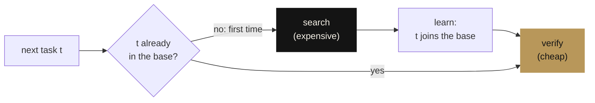

<div align="center">

**English** · [Português](README.pt-BR.md) · [Français](README.fr.md)

<picture>
  <source media="(prefers-color-scheme: dark)" srcset="docs/assets/banner-escuro.png">
  <source media="(prefers-color-scheme: light)" srcset="docs/assets/banner-claro.png">
  
</picture>

# James theorems

**The three pillars of James (knowledge, safety, soul) written as small formal models and proved in Lean 4: finding the proofs was search, checking them takes the kernel a second.**

[](lean-toolchain)
[](JamesTheorems)
[](Axiomas.lean)
[](lakefile.toml)

[Manifesto](MANIFESTO.en.md) ·
[Proofs](JamesTheorems) ·
[Matemática, the method applied](https://github.com/thiagopatzdorf/Matematica) ·
[Website](https://genesisinnovation.io/matematica)

</div>

---

## The problem in one picture

A system that has to repeat its own reasoning every time never gets cheaper. James is built on the opposite bet:
pay for discovery once, keep what was learned, and from then on only check. This is exactly the model proved in
[`Conhecimento.lean`](JamesTheorems/Conhecimento.lean):



Feed it the tasks `a b a a c b`: three searches (`a`, `b`, `c`), six verifications. In general, starting from an
empty base, **the number of searches is exactly the number `D` of distinct tasks** and the cost is
`D · search + N · verification`. When `D` grows more slowly than `N`, the cost per task tends to the cost of
checking: `O(n) → O(1)`, amortized. The other two pillars ask what keeps that knowledge safe and what keeps it
alive when the machine that holds it dies.

## I. Thesis

<p align="center">
  
</p>

The [mathematical manifesto](MANIFESTO.en.md) reads James through Kolmogorov complexity, Landauer's principle and
von Neumann's self-reproducing automaton: a universal machine that keeps its description on a versioned **tape**
`F` and works to minimize the size of what it knows plus what it still cannot explain about reality `X`. That
equation is a **model**, not a theorem; the manifesto classifies every claim (theorem, correspondence, model,
hypothesis) in its [honesty table](MANIFESTO.en.md#8-honesty-table). This repository is Phase 1: the three claims
small enough to prove.

## II. The three pillars

Each pillar is a model in Lean 4 and a theorem about it. The statements below are the real ones, copied from the
source.

### Knowledge · amortization

```lean
theorem amortizacao (c : Custos) (ts : List α) :
    let r := processar [] ts
    Distintos r.base ∧
    (∀ x, x ∈ r.base ↔ x ∈ ts) ∧
    r.buscas = r.base.length ∧
    custo c r = r.base.length * c.busca + ts.length * c.verificacao
```

Starting from an empty base, the final base has no repetitions and holds exactly the tasks seen; the number of
searches is its size `D`; and the total cost is `D · search + N · verification`, as an equality, with one fixed
search cost and one fixed verification cost.
[`James.Conhecimento.amortizacao`](JamesTheorems/Conhecimento.lean#L119)

### Safety · the approval gate

```lean
theorem gate (log : List Evento) : Seguro (log.foldl passo inicial)
```

For **every** event log, including one written by an adversary, every critical action that appears as executed
has a recorded approval. Safe actions run directly; an unapproved critical action leaves the state unchanged.
[`James.Seguranca.gate`](JamesTheorems/Seguranca.lean#L74)

### Soul · identity is the log

```lean
theorem replay (c₁ c₂ : Corpo Estado Evento) (h : c₁.passo = c₂.passo)
    (s₀ : Estado) (log : List Evento) :
    reproduzir c₁ s₀ log = reproduzir c₂ s₀ log
```

Two bodies (hosts) with the same transition reach the same state from the same log, whatever their name or
engine. [`retomada`](JamesTheorems/Alma.lean#L38): a body may die after any event and another resumes from the
snapshot. [`revezamento`](JamesTheorems/Alma.lean#L44): the log may be split among any number of bodies.
`rm -rf <host>` does not destroy James, as long as the log and the tape survive.
[`James.Alma.replay`](JamesTheorems/Alma.lean#L32)

## III. Verify it yourself

Three commands; the only requirement is [elan](https://lean-lang.org/install/), which installs the Lean version
pinned in `lean-toolchain`:

```bash
git clone https://github.com/thiagopatzdorf/james-theorems && cd james-theorems
lake build                    # the kernel checks the three pillars (no Mathlib: seconds)
lake env lean Axiomas.lean    # prints the axioms each theorem depends on
```

Expected output of the last command: only `propext` and `Quot.sound`. There is no `sorry` and no `native_decide`
in the repository.

## IV. Boundary

The theorems hold for the **models** defined here, not for production code. They say: *if* the system behaves
like the model, *then* the properties hold. The amortization theorem uses constant costs per search and per
verification; the manifesto's `S_max`/`V_max` inequality is its informal reading. That operational cost actually
falls as the tape compresses reality is a **hypothesis**, to be measured. Measuring whether the real system
behaves like the model is Phase 2: export real Factory logs, check the model against them, and turn every
divergence into a failing test.

<p align="center">
  
</p>

## V. Horizon

- **Phase 0** · mathematical manifesto ✔ ([MANIFESTO.en.md](MANIFESTO.en.md))
- **Phase 1** · the three pillars proved in Lean ✔ (this repository)
- **Phase 2** · anchor in the real code: validate traces against Factory logs
- **Phase 3** · James writes its own proofs, and the kernel checks them

The same method, discovering is expensive and verifying is cheap, runs at scale in
[Matemática](https://github.com/thiagopatzdorf/Matematica): a ledger of covering-code bounds where only what an
exact evaluator or the Lean kernel checks counts. The visual version is at
[genesisinnovation.io/matematica](https://genesisinnovation.io/matematica).

## VI. Layout · Cite · License

**Layout.** `JamesTheorems/` holds the three pillars, `Axiomas.lean` the axiom audit, `docs/assets/` the visual
identity (regenerated by `docs/assets/gerar_identidade.py`). The CI workflow lives in `ci/lean.yml`; to turn it on,
move it to `.github/workflows/lean.yml` (the token that created the repository had no `workflow` permission).

**Cite.** Metadata in [`CITATION.cff`](CITATION.cff); GitHub offers the "Cite this repository" button.

**License.** No license has been chosen yet, so all rights are reserved by default until the owner picks one.
