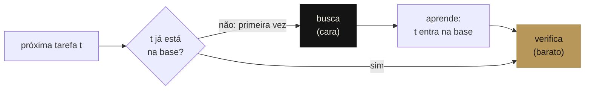

<div align="center">

[English](README.md) · **Português** · [Français](README.fr.md)

<picture>
  <source media="(prefers-color-scheme: dark)" srcset="docs/assets/banner-escuro.png">
  <source media="(prefers-color-scheme: light)" srcset="docs/assets/banner-claro.png">
  
</picture>

# Teoremas do James

**Os três pilares do James (conhecimento, segurança e alma) escritos como modelos formais pequenos e provados em Lean 4: achar as provas foi busca, conferi-las leva um segundo do kernel.**

[](lean-toolchain)
[](JamesTheorems)
[](Axiomas.lean)
[](lakefile.toml)

[Manifesto](MANIFESTO.md) ·
[Provas](JamesTheorems) ·
[Matemática, o método aplicado](https://github.com/thiagopatzdorf/Matematica) ·
[Página](https://genesisinnovation.io/matematica)

</div>

---

## O problema em uma imagem

Um sistema que precisa repetir o próprio raciocínio toda vez nunca fica mais barato. O James é construído na
aposta oposta: pagar a descoberta uma vez, guardar o que foi aprendido e, dali em diante, só conferir. É
exatamente o modelo provado em [`Conhecimento.lean`](JamesTheorems/Conhecimento.lean):



Dê a ele as tarefas `a b a a c b`: três buscas (`a`, `b`, `c`), seis verificações. Em geral, partindo de uma base
vazia, **o número de buscas é exatamente o número `D` de tarefas distintas** e o custo é
`D · busca + N · verificação`. Quando `D` cresce mais devagar que `N`, o custo por tarefa tende ao custo de
conferir: `O(n) → O(1)`, amortizado. Os outros dois pilares perguntam o que mantém esse conhecimento seguro e o
que o mantém vivo quando a máquina que o guarda morre.

## I. Tese

<p align="center">
  
</p>

O [manifesto matemático](MANIFESTO.md) lê o James pela complexidade de Kolmogorov, pelo princípio de Landauer e
pelo autômato autorreprodutor de von Neumann: uma máquina universal que guarda a própria descrição numa **fita**
versionada `F` e trabalha para minimizar o tamanho do que sabe mais o que ainda não consegue explicar da realidade
`X`. Essa equação é um **modelo**, não um teorema; o manifesto classifica cada afirmação (teorema,
correspondência, modelo, hipótese) na sua [tabela de honestidade](MANIFESTO.md#8-tabela-de-honestidade). Este
repositório é a Fase 1: as três afirmações pequenas o bastante para provar.

## II. Os três pilares

Cada pilar é um modelo em Lean 4 e um teorema sobre ele. Os enunciados abaixo são os reais, copiados do fonte.

### Conhecimento · amortização

```lean
theorem amortizacao (c : Custos) (ts : List α) :
    let r := processar [] ts
    Distintos r.base ∧
    (∀ x, x ∈ r.base ↔ x ∈ ts) ∧
    r.buscas = r.base.length ∧
    custo c r = r.base.length * c.busca + ts.length * c.verificacao
```

Partindo de uma base vazia, a base final não tem repetições e contém exatamente as tarefas vistas; o número de
buscas é o tamanho dela, `D`; e o custo total é `D · busca + N · verificação`, com igualdade, para um custo fixo de
busca e um de verificação.
[`James.Conhecimento.amortizacao`](JamesTheorems/Conhecimento.lean#L119)

### Segurança · o gate de aprovação

```lean
theorem gate (log : List Evento) : Seguro (log.foldl passo inicial)
```

Para **todo** log de eventos, inclusive um escrito por um adversário, toda ação crítica que aparece executada tem
aprovação registrada. Ações seguras executam direto; uma ação crítica não aprovada deixa o estado como estava.
[`James.Seguranca.gate`](JamesTheorems/Seguranca.lean#L74)

### Alma · a identidade é o log

```lean
theorem replay (c₁ c₂ : Corpo Estado Evento) (h : c₁.passo = c₂.passo)
    (s₀ : Estado) (log : List Evento) :
    reproduzir c₁ s₀ log = reproduzir c₂ s₀ log
```

Dois corpos (hosts) com a mesma transição chegam ao mesmo estado a partir do mesmo log, quaisquer que sejam nome
e motor. [`retomada`](JamesTheorems/Alma.lean#L38): um corpo pode morrer depois de qualquer evento e outro
retoma do snapshot. [`revezamento`](JamesTheorems/Alma.lean#L44): o log pode ser dividido entre quaisquer
corpos. `rm -rf <host>` não destrói o James, desde que o log e a fita sobrevivam.
[`James.Alma.replay`](JamesTheorems/Alma.lean#L32)

## III. Confira você mesmo

Três comandos; o único requisito é o [elan](https://lean-lang.org/install/), que instala a versão do Lean fixada em
`lean-toolchain`:

```bash
git clone https://github.com/thiagopatzdorf/james-theorems && cd james-theorems
lake build                    # o kernel confere os três pilares (sem Mathlib: segundos)
lake env lean Axiomas.lean    # imprime os axiomas de que cada teorema depende
```

Saída esperada do último comando: só `propext` e `Quot.sound`. Não há `sorry` nem `native_decide` no repositório.

## IV. Fronteira

Os teoremas valem para os **modelos** definidos aqui, não para o código de produção. Eles dizem: *se* o sistema
se comporta como o modelo, *então* as propriedades valem. O teorema da amortização usa custos constantes por
busca e por verificação; a desigualdade com `S_max`/`V_max` do manifesto é a leitura informal dele. Que o custo
operacional de fato caia à medida que a fita comprime a realidade é uma **hipótese**, a medir. Medir se o
sistema real se comporta como o modelo é a Fase 2: exportar logs reais da Factory, checar o modelo contra eles e
transformar cada divergência em teste que falha.

<p align="center">
  
</p>

## V. Horizonte

- **Fase 0** · manifesto matemático ✔ ([MANIFESTO.md](MANIFESTO.md))
- **Fase 1** · os três pilares provados em Lean ✔ (este repositório)
- **Fase 2** · ancorar no código real: validação de traços contra logs da Factory
- **Fase 3** · o James escreve as próprias provas, e o kernel verifica

O mesmo método, descobrir é caro e verificar é barato, roda em escala no
[Matemática](https://github.com/thiagopatzdorf/Matematica): um ledger de cotas de códigos de cobertura onde só
conta o que um avaliador exato ou o kernel do Lean confere. A versão visual está em
[genesisinnovation.io/matematica](https://genesisinnovation.io/matematica).

## VI. Estrutura · Citar · Licença

**Estrutura.** `JamesTheorems/` guarda os três pilares, `Axiomas.lean` a auditoria de axiomas, `docs/assets/` a
identidade visual (regenerada por `docs/assets/gerar_identidade.py`). O workflow de CI está em `ci/lean.yml`; para
ativar, mova para `.github/workflows/lean.yml` (o token usado na criação do repositório não tinha permissão de
`workflow`).

**Citar.** Metadados em [`CITATION.cff`](CITATION.cff); o GitHub oferece o botão "Cite this repository".

**Licença.** [CC BY 4.0](LICENSE): compartilhe e adapte à vontade, com atribuição.
